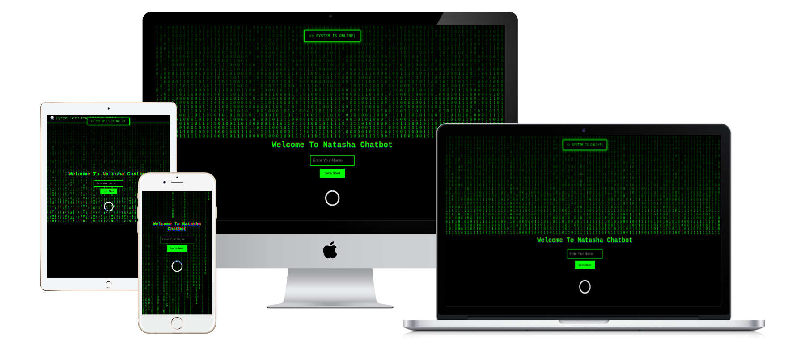

# Natasha Virtual Assistant 🔮

Natasha is an advanced AI-powered virtual assistant built using HTML, CSS, JavaScript, and Web APIs. It features a hacker-style animated UI with voice command capabilities, chatbot interaction, and smart automation for tasks like astrology queries, command execution, and system notifications.

## 🚀 Features

- 🎤 **Voice Command Support** 
  Control the assistant using your voice with support for predefined commands.

- 🧠 **Smart Command Processing** 
  Recognizes commands like "love", "career", "compatibility", and executes audio responses.

- 💬 **Animated Chat UI** 
  Hacker-style auto-typing chat messages and speech animations.

- 🔊 **Audio Feedback** 
  Unique audio clips for different commands, notifications, and user actions.

- 🌗 **Dark/Light Theme Toggle** 
  Switch between modern dark and light modes.

- 📄 **Export Options** 
  Export chat history and command list as PDF with timestamped formatting.

- 🎛️ **Quick Command Buttons** 
  UI buttons for popular queries like Love, Career, Education, etc.

- 🟢 **Online/Offline Detection** 
  Real-time popup alerts with auto-typing animation for system status.

- 🧭 **Navigation Commands** 
  Commands like “Go portfolio”, “Open Mezo chatbot”, “Back to homepage” perform voice-controlled page redirection.

- 🎨 **Fully Responsive Design** 
  Works seamlessly across mobile, tablet, and desktop.

- 🧞‍♀️ **Avatar Animation** 
  Animated chatbot face that reacts when speaking or listening.

- 📍 **Loading Indicators** 
  Top-right processing GIFs and loaders shown during voice interaction.

## 📁 Project Structure

natasha-assistant/ │ ├── index.html               # Main assistant HTML file ├── style.css                # Styling for animations, layout, and themes ├── script.js                # Handles voice commands, DOM events, audio, and logic ├── assets/ │   ├── audio/               # All voice clips and sound effects │   ├── images/              # Assistant avatars, loading GIFs, icons │   └── pdf/                 # Exported PDF data └── README.md                # Project documentation

---

🛠️ Tech Stack

HTML5 + CSS3

JavaScript (Vanilla)

Web Speech API (Voice Recognition)

jsPDF for PDF generation

LocalStorage for session history

---

📢 Example Commands

Command Action

Say career Plays career prediction audio
Download history Exports chat history PDF
Dark mode Switches theme to dark
Go portfolio Navigates to portfolio page
Open Mezo chatbot Opens Mezo assistant in a new tab
System status Shows online/offline popup
Mute / Unmute Toggles assistant voice

---

## 📷 Preview 

---
🧑‍💻 Developed By

* Harshad Teli 

---

## 🔗 Connect with Me

---

## 📲 Deploy Project

---

## 📬feedback Form 

---

✨ Future Improvements

AI-powered NLP response handling

Integration with APIs (weather, news, etc.)

Custom user profiles and voice recognition

🤝 Contributing

Pull requests are welcome! For major changes, please open an issue first to discuss what you would like to change.

---

## 📜 License

You can show the License in the follow way

* [App License](license.txt)

---

© 2025 HarshTech |  All rights reserved.

---
